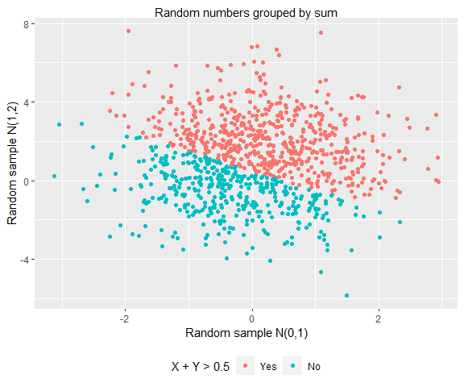
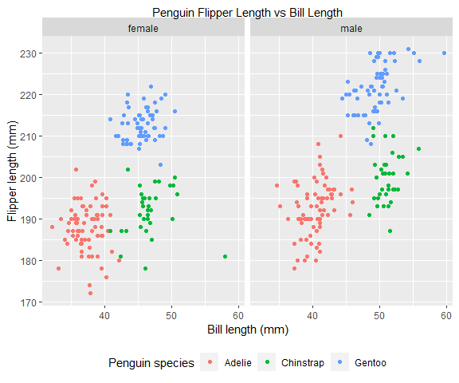

PUBH 7462 Homework 1
================
Christopher Rounds
1/29/2022

# 2.1 Independent Bivariate Normal Random Sample

``` r
problem2.1 = tibble(x = rnorm(n = 1000, mean = 0, sd = 1),
                    y = rnorm(n = 1000, mean = 1, sd = 2),
                    sum_indicator = ifelse(x + y > 0.5, TRUE, FALSE)) # if x + y > 0.5 then answer is TRUE 

problem2.1 %>%
  mutate(sum_indicator = ifelse(sum_indicator == TRUE, "Yes", "No")) %>% # change logical to Yes/No
  mutate(sum_indicator = as.factor(sum_indicator), # make Yes/No a factor
         sum_indicator = forcats::fct_relevel(sum_indicator, "Yes", "No")) %>% # make Yes come before No
  ggplot(aes(x = x, y = y, colour = sum_indicator)) + #pipe to ggplot with y~x coloured by factor
  geom_point() +
  ggtitle("Random numbers grouped by sum") +
  xlab("Random sample N(0,1)") +
  ylab("Random sample N(1,2)") +
  guides(colour = guide_legend(title = "X + Y > 0.5"))
```



# 2.2 Penguin EDA

## 2.2.1 Data Description

``` r
penguin.df <- read_rds("./data/penguin.RDS") # read in the data

mean_flipper_length <- mean(penguin.df$flipper_length_mm, na.rm = TRUE) # obj with mean flipper length
sd_flipper_length <- sd(penguin.df$flipper_length_mm, na.rm = TRUE) # obj with sd flipper length
mean_bill_length <- mean(penguin.df$bill_length_mm, na.rm = TRUE) # obj with mean bill length
sd_bill_length <- sd(penguin.df$bill_length_mm, na.rm = TRUE) # obj with sd bill length
columnnames = colnames(penguin.df) # names of variables
nrows <- NROW(penguin.df) # number of obs
```

The data frame has a total of 344 observations, each corresponding to an
individual penguin. There are 8 variables to describe each penguin. The
factor variables mainly describe different attributes of the sampling.
The variable species describes the species of penguin, the variable
island describes the island where the penguin was found in Antarctica,
the variable year describes the year the penguin was sampled. The factor
variable sex describes the sex of the penguin. The numerical variables
describe attributes about the penguins that are sampled. The variable
bill_length_mm describes the bill length of the penguin in mm, the
variable bill_depth_mm describes the bill depth of the penguin in mm,
the variable flipper_length_mm describes the flipper length of the
penguin in mm, the variable body_mass_g describes the mass of the
penguin in grams.

Mean of the flipper length is 200.92 mm, the standard deviation is
14.06  
Mean of the bill length is 43.92 mm, the standard deviation is 5.46

## 2.2.2 Penguin Data Visualization

``` r
penguin.df %>%
  dplyr::filter(complete.cases(.)) %>% # only use if there are no NA values in any columns
  ggplot() +
  geom_point(aes(x = bill_length_mm, y = flipper_length_mm, colour = species)) + # flipper length~bill length colored by species
  facet_grid(cols = vars(sex)) + # seperate grids into sex
  ggtitle("Penguin Flipper Length vs Bill Length") +
  xlab("Bill length (mm)") +
  ylab("Flipper length (mm)") +
  guides(colour = guide_legend(title = "Penguin species"))
```



Overall, males penguins are shifted to the upper right (i.e. they have
longer bills and flippers). Gentoo penguins generally have the longest
bills and flippers, although there appears to be a female Chinstrap with
an absolutely massive bill. Adelie penguins consistently have the
smallest bills and flippers while chinstraps have around the same
flipper size as Adelie and around the same bill size as Gentoo. It seems
odd that the flipper length is consistently a maximum of 230mm (maybe
the measurment tool had a maximum size?).
